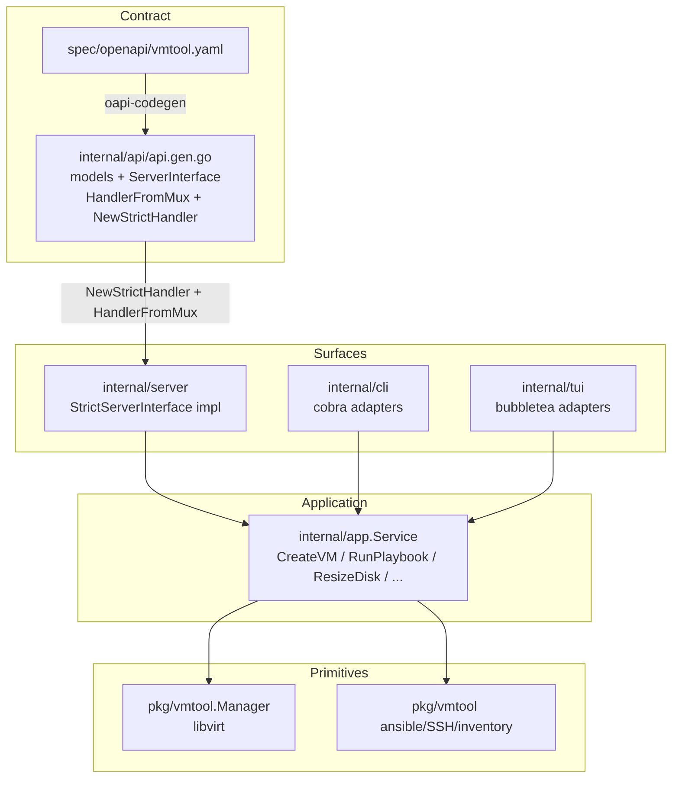
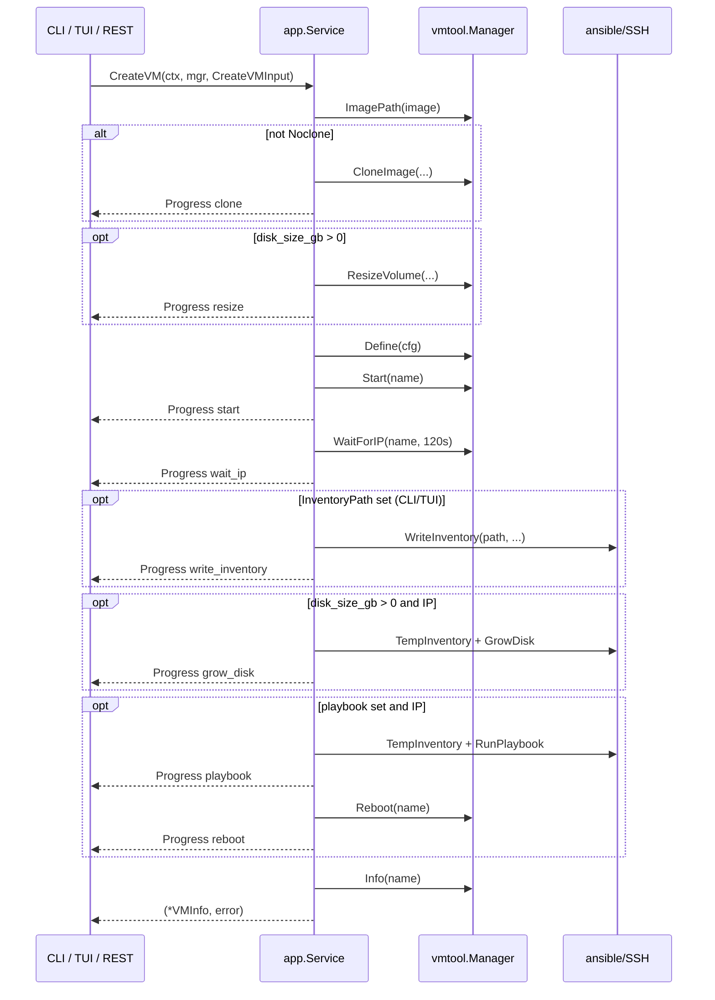

# Spec-first vmtool: one OpenAPI contract, three surfaces

| Field | Value |
|---|---|
| **Date** | 2026-08-13 |
| **Status** | Draft |
| **Repo** | `/home/jared/repos/github/vmtool` |
| **Prior art** | `/home/jared/worktrees/interloc` (`spec/`, `AGENTS.md` hard rule 3, `docs/CONVENTIONS.md` § Spec-first) |

---

## Overview

vmtool is a Go library + CLI/TUI for KVM/QEMU VMs via libvirt, plus Ansible playbooks and a recently added hand-written REST server. Today the three user surfaces — cobra CLI (`internal/cli/cli.go`), bubbletea TUI (`internal/tui/tui.go`), and stdlib `net/http` REST (`internal/server/server.go`) — each orchestrate the same workflows independently. Create-and-provision, playbook, and resize-disk are implemented three times with divergent error handling, inventory strategy, and even different `noclone` semantics. REST documentation is a hand-maintained `endpoints()` slice, not a contract.

This design makes an OpenAPI 3.0.3 spec the source of record for HTTP names, routes, payloads, and status codes; generates the REST server interface, models, and embedded spec with oapi-codegen (stdlib `ServerInterface` + `strict-server`, not interloc's models-only approach); and extracts a thin shared application layer (`internal/app`) that CLI, TUI, and generated REST handlers all call. There is no OpenAPI→cobra or OpenAPI→bubbletea generator — those adapters stay hand-written and thin. The change lands as five independently mergeable PRs (PR4 can proceed in parallel with PR3).

---

## Background & Motivation

### Current architecture

```
cmd/vmtool/main.go
        └── internal/cli.Execute()          cobra
                ├── create/start/stop/...   each opens vmtool.NewManager()
                ├── i  → internal/tui.Run() long-lived Manager
                └── server → internal/server.ListenAndServe()
                                    per-request NewManager()

pkg/vmtool/   Manager (libvirt), inventory, ansible, SSH, .machines
```

`pkg/vmtool.Manager` (`pkg/vmtool/libvirt.go`) is a solid primitive layer: `Create`, `Start`, `Stop`, `Destroy`, `Delete`, `Info`, `List`, `WaitForIP`, `SetAutostart`, `Reboot`, `ResizeDisk`, `MigrateDisk`, `ListNetworks`, `ListBridges`, `ListImagesByPool`, `DeleteImage`, `ListPools`, `CreatePool`. Ansible (`RunPlaybook`, `GrowDisk`) and SSH (`SSHCmd`, `RemoteCmd`) are also primitives.

What is *not* a primitive — and is duplicated — is the **workflow**: resolve image → apply defaults → clone/resize/define/start → wait for IP → write inventory → grow guest filesystem → run playbook → reboot.

### Pain points (observed in code, not hypothetical)

1. **Create is three different programs.**
   - CLI (`createCmd` in `internal/cli/cli.go`) calls `m.Create(cfg)`, waits 120s for IP (`WaitForIP(name, 120*1e9)`), writes `ansible/inventory.yml`, then `GrowDisk(inventory)` against that *persistent* file, then `RunPlaybook` + `Reboot`. Grow errors are fatal. Playbook requested with no IP is a CLI error.
   - REST (`handleCreateVM`) calls `m.Create(cfg)`, waits 120s but **ignores the timeout** (`ip, _ := m.WaitForIP(...)`); grow/playbook are skipped when `ip == ""`. Uses `TempInventory` for grow/playbook. **Swallows** `GrowDisk` errors (`_ = vmtool.GrowDisk(...)`) and **swallows reboot** after playbook (`_ = m.Reboot`). Playbook failure is already 500. ImagePath miss is 400.
   - TUI (`submitCreate` / `stageClone`…`stageReboot` in `internal/tui/tui.go`) **does not call `m.Create`**. It reimplements clone → resize volume → define+start, always clones (no `noclone`), writes the persistent inventory, and does not call `DefaultConfig` (it builds `VMConfig` by hand). No-IP is a TUI error and skips playbook; grow failure is logged but playbook still runs.

2. **REST docs drift by construction.** `Server.endpoints()` is a parallel catalog of every route. `GET /` renders it. Nothing checks it against `Handler()`.

3. **Status codes are inconsistent.** 404 is used by GET, cmd, and playbook on a missing domain. 409 is used by cmd **and** playbook when the VM has no IP. 502 is used only by cmd (SSH transport). DELETE/start/stop/resume/poweroff/reboot/autostart/migrate/resize/delete-image map **all** libvirt errors to 500, including "no such domain."

4. **Naming already almost-unifies, then slips.** JSON uses `memory_mib` / `disk_size_gb` / `net_type`. CLI flags are `--memory` / `--disk-size` / `--net-type`. TUI has `macvtap_mode`; CLI create has **no** `--macvtap-mode`. REST has `POST /vms/{name}/reboot`; CLI has no `reboot` command.

5. **TUI-only host mutation.** `vmtool.CreateBridge` (`pkg/vmtool/bridge.go`) is reachable only from the TUI "New Bridge..." flow. REST exposes `GET /bridges` but not create. That is a scope decision, not an accident — called out below.

### Why interloc's mentality, not interloc's exact stack

interloc is spec-first because field-deployed agents and a React UI consume a versioned HTTP API. It generates **models + client only** (`internal/api/cfg.yaml`) because Fiber v3 has no released oapi-codegen server generator; handlers stay hand-written and a `TestSpecParity` pins `RegisterRoutes` == spec operations as sets.

vmtool is a local operator tool (default bind `127.0.0.1:8080`, no auth, one binary). It already uses Go 1.22 `http.ServeMux` method+path patterns (`mux.HandleFunc("POST /vms/{name}/start", ...)`). That is exactly the surface oapi-codegen's `std-http-server` generator emits. We should generate the server interface, not just models.

---

## Goals & Non-Goals

### Goals

- OpenAPI 3.0.3 file is the source of record for routes, operationIds, request/response schemas, and status codes.
- One shared application layer implements every mutating/listing workflow. CLI, TUI, and REST are adapters.
- REST layer is generated from the spec (`std-http-server` + models + embedded spec + client).
- `GET /` dumps API docs **from the spec**, not from `endpoints()`.
- Spec ↔ registered-route parity test (interloc `specparity_test.go` adapted to stdlib mux).
- `go generate` + committed-output staleness check (`scripts/verify-generate.sh`).
- Project rules (`AGENTS.md`, `spec/README.md`) that force: change spec → regenerate → handlers/CLI/TUI/tests.
- Incremental PR sequence; each PR independently reviewable and mergeable.
- Unify names across JSON / CLI flags / app types (aliases for old CLI flags).

### Non-Goals

- Generate cobra commands or bubbletea forms from OpenAPI. No mature generator is cheaper than thin adapters over `internal/app`.
- HTTP auth, TLS, or binding on `0.0.0.0` by default.
- Introducing `/api/v1` (see Key Decisions).
- Putting interactive SSH (`vmtool ssh`, TUI `t`) on the REST surface.
- Adding TUI coverage for every REST/CLI verb in this effort (resume, poweroff, reboot, cmd, resize, migrate, images, pools). When TUI grows, it calls `internal/app`.
- Shipping `POST /bridges` in the first cut (TUI-only host-network mutation; remains deferred).
- Changing libvirt XML, Packer images, or Ansible playbook contents.
- A public remote-CLI mode that talks HTTP instead of libvirt. The generated client is for tests (and a future option), not a rewrite of `vmtool create`.
- **No job queue, async create, or websocket/SSE progress on REST.** Create and playbook stay synchronous HTTP requests that can run for minutes. Progress events (`OnProgress`) are CLI/TUI only.

---

## Proposed Design

### Layering



`pkg/vmtool` stays a library of primitives (including `Manager.Create` for direct library callers). Workflows that currently live in CLI/TUI/REST move to `internal/app`. That split is deliberate: a library consumer can still call `Manager.Create` without pulling Ansible orchestration, and the three surfaces stop re-deriving "create then wait then grow then playbook."

### Request flow (create)

`CreateVM` does **not** call `m.Create`. It drives the same primitive steps the TUI already uses, so it can emit one progress event per stage and still honor `Noclone`.



TUI today drives this as seven staged `tea.Cmd`s (`stageClone` … `stageReboot`). After the move it still *displays* those stages via `OnProgress`, but the work is a single `CreateVM` call. CLI may print the same stages. REST ignores progress and maps the returned `(*VMInfo, error)` through the create matrix below.

`pkg/vmtool.Manager.Create` remains as a primitive (clone+resize+define+start, honors `Noclone`). `app.Manager` does **not** include `Create`; app reimplements that sequence so progress hooks exist.

### File layout (target)

```
spec/
  README.md                 # contract, coverage policy, exclusion register, workflow
  openapi/
    vmtool.yaml             # source of record
scripts/
  verify-generate.sh        # go generate + git diff --exit-code -- internal/api
internal/
  api/
    generate.go             # //go:generate oapi-codegen
    cfg.yaml
    tools.go                # pin oapi-codegen in go.mod (tools build tag)
    api.gen.go              # COMMITTED generated output
  app/
    service.go              # Service, Options, Manager interface
    create.go
    lifecycle.go            # start/stop/resume/poweroff/reboot/delete/autostart
    guest.go                # cmd, playbook
    disk.go                 # resize, migrate
    inventory.go            # list networks/bridges/images/pools/playbooks
    errors.go
    *_test.go
  server/
    server.go               # ListenAndServe, Handler() wiring
    handlers.go             # implements api.StrictServerInterface
    docs.go                 # GetDocs / GetOpenAPISpec (//go:embed spec yaml)
    specparity_test.go
    server_test.go          # updated TestDocsRoot
  cli/cli.go                # thin cobra → app
  tui/tui.go                # thin tea → app
AGENTS.md
```

Optional, not required for PR1: root / `spec/` justfiles that wrap `go generate` and `scripts/verify-generate.sh`. The required generate entrypoint is `go generate ./internal/api/...`.

### oapi-codegen: generate the stdlib server

interloc cannot generate a Fiber v3 server. vmtool can. **Generate `std-http-server` + `strict-server` + `models` + `embedded-spec` + `client`.**

Concrete config, `internal/api/cfg.yaml`:

```yaml
# yaml-language-server: $schema=https://raw.githubusercontent.com/oapi-codegen/oapi-codegen/v2.4.1/configuration-schema.json
package: api
output: api.gen.go
generate:
  models: true
  std-http-server: true
  strict-server: true
  embedded-spec: true
  client: true
```

`internal/api/generate.go`:

```go
package api

//go:generate go run github.com/oapi-codegen/oapi-codegen/v2/cmd/oapi-codegen --config=cfg.yaml ../../spec/openapi/vmtool.yaml
```

`internal/api/tools.go` (same pattern as interloc):

```go
//go:build tools

package api

import (
	_ "github.com/oapi-codegen/oapi-codegen/v2/cmd/oapi-codegen"
)
```

**Why this mix**

| Flag | Why |
|---|---|
| `std-http-server` | Emits `ServerInterface` + `HandlerFromMux` using Go 1.22 `ServeMux` patterns (`POST /vms/{name}/start`). Matches today's server. Adds **no** chi/gin/echo dependency. |
| `strict-server` | Second interface whose methods take `CreateVMRequestObject` and return `(CreateVMResponseObject, error)`. Status-code response types are generated from the spec (`CreateVM201JSONResponse`, `CreateVM400JSONResponse`, `CreateVM500JSONResponse`). Compile-time: every operation has an impl. Handlers stop hand-writing `writeJSON`/`decodeJSON`. Drop to plain `ServerInterface` only if review hates the response unions — one-line config change. Do not drop server generation. |
| `models` | Shared request/response structs with the JSON names the spec owns. |
| `embedded-spec` | Gzipped spec inside `api.gen.go` (useful for the generated client / middleware). **Serving** YAML/JSON/text docs uses a single `//go:embed` of `spec/openapi/vmtool.yaml`, not this blob, so the committed file is the only served artifact. |
| `client` | `httptest` + generated client for server tests (PR5 if needed; usable from PR3). Not used by the CLI. |

**Go version bump (required).** Current `go.mod` is `go 1.22`. `github.com/oapi-codegen/runtime` (imported by generated code) requires **Go 1.24+**. Pin:

- `go 1.24` (minimum).
- `github.com/oapi-codegen/oapi-codegen/v2 v2.4.1` (same pin as interloc; has `std-http-server`).
- `github.com/oapi-codegen/runtime v1.4.2`
- `github.com/getkin/kin-openapi` for `specparity_test.go` and text-docs rendering.

Latest oapi-codegen *tooling* wants Go 1.25 to *build the generator*; `go run` of the v2.4.1 module (as interloc does) avoids that. Do not float `@latest`.

**Root-path pattern (PR1 must record this).** oapi-codegen has historically emitted `GET /` as a catch-all on std-http (issues #1743 / #1952). v2.4.1's trailing-slash fix may emit `GET /{$}` instead. In PR1, generate the real spec (or a one-path spike) and **commit the observed pattern string** in `spec/README.md`. Add `TestDocsNotFound`: `GET /nope` is 404, not the docs body. If v2.4.1 still emits a catch-all:

1. Prefer pinning a newer generator that emits `GET /{$}` (accept its Go floor if needed).
2. Fallback: keep `getDocs` / `getOpenAPISpec` **off** the generated mux, register them by hand, and list them in the exclusion register.

Do **not** both generate those routes and pre-`HandleFunc` them. Go 1.22 `ServeMux` panics on a duplicate pattern.

**Optional request validation.** `github.com/oapi-codegen/nethttp-middleware` `OapiRequestValidator` can wrap the mux so required fields and enums (`net_type`, `macvtap_mode`) are enforced from the spec. Add it in PR3 if it stays a few lines; do not block on it.

### Shared application layer

```go
package app

// Manager is the libvirt surface Service needs.
// *vmtool.Manager satisfies this. There is no Create method:
// CreateVM calls CloneImage / ResizeVolume / Define / Start itself.
type Manager interface {
	Start(name string) error
	Stop(name string) error
	Resume(name string) error
	Destroy(name string) error
	Delete(name string, noclone bool) error
	Info(name string) (*vmtool.VMInfo, error)
	List() ([]vmtool.VMInfo, error)
	WaitForIP(name string, timeout time.Duration) (string, error)
	SetAutostart(name string, enabled bool) error
	Reboot(name string) error
	ResizeDisk(name string, sizeGB uint) error
	MigrateDisk(name, pool string) error
	ImagePath(name string) (string, error)
	ListNetworks() ([]string, error)
	ListBridges() ([]string, error)
	ListImagesByPool() (map[string][]string, error)
	DeleteImage(name, pool string) error
	ListPools() ([]vmtool.PoolInfo, error)
	CreatePool(name, path string) error
	CloneImage(basePath, newName, targetPool string) (string, error)
	ResizeVolume(volPath string, sizeBytes uint64) error
	Define(cfg vmtool.VMConfig) error
}

type Service struct {
	PlaybookDir   string        // default ansible/playbooks; ListPlaybooks reads this
	InventoryPath string        // optional persistent inventory (CLI/TUI); REST leaves empty
	IPTimeout     time.Duration // default 120 * time.Second
}

type ProgressFunc func(ProgressEvent)

type ProgressEvent struct {
	Stage  string // clone|resize|start|wait_ip|write_inventory|grow_disk|playbook|reboot
	Status string // start|done|error
	Detail string
	Output string // playbook stdout (also set on Status=="error")
}

type CreateVMInput struct {
	Name        string
	Image       string
	VCPUs       uint
	MemoryMiB   uint
	DiskSizeGB  uint
	Pool        string
	NetType     string
	NetSource   string
	MacvtapMode string
	SSHUser     string
	SSHPass     string
	Playbook    string
	Noclone     bool
	OnProgress  ProgressFunc
}

type CmdResult struct {
	ExitCode int
	Stdout   string
	Stderr   string
}

type PlaybookResult struct {
	Output string // ansible combined stdout/stderr; set on success and on failure
}

type ResizeResult struct {
	VM              vmtool.VMInfo
	FilesystemGrown bool
	GrowError       string // set iff guest grow failed; Err is nil
}

func (s *Service) CreateVM(ctx context.Context, m Manager, in CreateVMInput) (*vmtool.VMInfo, error)
func (s *Service) GetVM(ctx context.Context, m Manager, name string) (*vmtool.VMInfo, error)
func (s *Service) ListVMs(ctx context.Context, m Manager) ([]vmtool.VMInfo, error)
func (s *Service) DeleteVM(ctx context.Context, m Manager, name string, noclone bool) error
func (s *Service) StartVM(ctx context.Context, m Manager, name string) (*vmtool.VMInfo, error)
func (s *Service) StopVM(ctx context.Context, m Manager, name string) (*vmtool.VMInfo, error)
func (s *Service) ResumeVM(ctx context.Context, m Manager, name string) (*vmtool.VMInfo, error)
func (s *Service) PoweroffVM(ctx context.Context, m Manager, name string) (*vmtool.VMInfo, error)
func (s *Service) RebootVM(ctx context.Context, m Manager, name string) (*vmtool.VMInfo, error)
func (s *Service) SetAutostart(ctx context.Context, m Manager, name string, enabled bool) (*vmtool.VMInfo, error)
func (s *Service) RunCommand(ctx context.Context, m Manager, name string, argv []string) (*CmdResult, error)
func (s *Service) RunPlaybook(ctx context.Context, m Manager, name, playbook string, auth vmtool.Auth) (*PlaybookResult, error)
func (s *Service) MigrateDisk(ctx context.Context, m Manager, name, pool string) (*vmtool.VMInfo, error)
func (s *Service) ResizeDisk(ctx context.Context, m Manager, name string, sizeGB uint, auth vmtool.Auth) (*ResizeResult, error)
func (s *Service) ListNetworks(ctx context.Context, m Manager) ([]string, error)
func (s *Service) ListBridges(ctx context.Context, m Manager) ([]string, error)
func (s *Service) ListImages(ctx context.Context, m Manager) (map[string][]string, error)
func (s *Service) DeleteImage(ctx context.Context, m Manager, name, pool string) error
func (s *Service) ListPools(ctx context.Context, m Manager) ([]vmtool.PoolInfo, error)
func (s *Service) CreatePool(ctx context.Context, m Manager, name, path string) error
func (s *Service) ListPlaybooks() ([]string, error) // *.yml and *.yaml in s.PlaybookDir
```

**Why app types are not the generated OpenAPI structs.** Strict-server models use pointers for every optional field (`*uint`, `*string`). That is correct for HTTP but hostile as an internal API. `internal/app` uses concrete fields and the **same names** as the spec (`MemoryMiB` ↔ `memory_mib`). REST handlers are the only place that copies generated request objects → `CreateVMInput`.

**Manager lifecycle stays at the adapter.** CLI and REST already do `NewManager()` / `Close()` per invocation (`withManager` in both packages). TUI holds one `*vmtool.Manager` for the process. Service methods take `Manager` as an argument so we do not force TUI to reconnect to libvirt per keystroke.

### App semantics

**Playbook path resolution** — one function, used by `CreateVM` and `RunPlaybook`:

```go
func (s *Service) resolvePlaybook(name string) (string, error) {
	if name == "" {
		return "", &Error{Kind: KindInvalid, Op: "playbook", Err: fmt.Errorf("playbook is required")}
	}
	// Reject a ".." path element. Do not use strings.Contains(name, "..") —
	// that false-rejects names like foo..yml.
	for _, el := range strings.Split(filepath.ToSlash(name), "/") {
		if el == ".." {
			return "", &Error{Kind: KindInvalid, Op: "playbook", Err: fmt.Errorf("playbook path must not contain ..")}
		}
	}
	if !strings.HasSuffix(name, ".yml") && !strings.HasSuffix(name, ".yaml") {
		return "", &Error{Kind: KindInvalid, Op: "playbook", Err: fmt.Errorf("playbook must end in .yml or .yaml")}
	}
	if filepath.IsAbs(name) || strings.ContainsRune(name, filepath.Separator) {
		return name, nil
	}
	base := filepath.Clean(s.PlaybookDir)
	resolved := filepath.Clean(filepath.Join(base, name))
	if resolved != base && !strings.HasPrefix(resolved, base+string(filepath.Separator)) {
		return "", &Error{Kind: KindInvalid, Op: "playbook", Err: fmt.Errorf("playbook escapes PlaybookDir")}
	}
	return resolved, nil
}
```

Call `resolvePlaybook` only when a playbook was requested (`in.Playbook != ""` on create, or the `playbook` argument of `RunPlaybook`). An omitted create playbook is not an error.

This matches today's REST `playbookPath` plus an element-wise `..` check. CLI create currently passes `--playbook` straight through (`cli.go:158`); after PR2, bare `setup_bot.yml` resolves under `PlaybookDir` (new, useful) and `ansible/playbooks/setup_bot.yml` still works because it contains a separator. Document both forms in the CLI help text.

`ListPlaybooks` today only lists `*.yml` (`ansible.go:19`). PR2 teaches `pkg/vmtool.ListPlaybooks` (and therefore `Service.ListPlaybooks` / `GET /playbooks` / the TUI picker) to include `*.yaml` so the list matches `resolvePlaybook`.

**Auth**

| Call | Auth |
|---|---|
| `RunCommand` | No `Auth` parameter. Uses `vmtool.ResolveAuth(ip, name, vmtool.DefaultAuth())` (`.machines` then packer). Matches REST/CLI `cmd` today. |
| `RunPlaybook` / `ResizeDisk` | Take `auth vmtool.Auth`. REST handlers pass `vmtool.DefaultAuth()` (then `ResolveAuth` inside, same as today). CLI `playbook` / `resize-disk` pass `--ssh-user` / `--ssh-pass`. REST request schemas do **not** grow `ssh_user`/`ssh_pass`. |
| `CreateVM` | Uses `SSHUser`/`SSHPass` from input (REST body / CLI flags / TUI form), then `ResolveAuth` for grow/playbook. |

**Context.** Every `Service` method takes `ctx` for future cancel. **This effort does not plumb `ctx` into `WaitForIP` or `ansible-playbook`.** `WaitForIP` stays a 1s-poll loop (`libvirt.go`); `RunPlaybook` stays `exec.Command` without `CommandContext` (`ansible.go`). An HTTP disconnect will not abort a 10-minute playbook. Acceptable for a loopback operator tool. Plumbing `CommandContext` / a cancellable `WaitForIP` is a later `pkg/vmtool` API change, not in these PRs.

**`app.Error`** implements `error` and `Unwrap`:

```go
type Kind int

const (
	KindInvalid Kind = iota // 400
	KindNotFound            // 404
	KindConflict            // 409: cmd or playbook on a domain that exists but has no IP (not create-name-collision)
	KindBadGateway          // 502  (SSH transport)
	KindInternal            // 500
)

type Error struct {
	Kind   Kind
	Op     string // create|get|list|delete|start|stop|resume|poweroff|reboot|autostart|cmd|playbook|migrate_disk|resize_disk|list_networks|list_bridges|list_images|delete_image|list_pools|create_pool|list_playbooks
	Err    error
	Output string // ansible combined output when Op=="playbook"; empty otherwise
}

func (e *Error) Error() string { /* Op + Err */ }
func (e *Error) Unwrap() error { return e.Err }
```

`Output` is the single channel for ansible stdout/stderr on failure. There is no `PlaybookResult.Err`.

- `CreateVM` playbook fail: `(*VMInfo, &Error{Kind: KindInternal, Op: "playbook", Err: ansibleErr, Output: out})`. REST copies `Error.Output` → JSON `output`.
- `RunPlaybook` ansible fail: `(*PlaybookResult{Output: out}, &Error{Kind: KindInternal, Op: "playbook", Err: ansibleErr, Output: out})`. Success is `(*PlaybookResult{Output: out}, nil)`.
- Create-time playbook also emits `OnProgress` with `Status=="error"` and `Output` set, so TUI can fill the log pane. REST ignores progress and reads `Error.Output`.

CLI and TUI print `err.Error()` (and `Error.Output` / `PlaybookResult.Output` when present). They do not switch on `Kind`.

A create-of-duplicate name fails in `Define` as `KindInternal` / HTTP 500 (today's behavior). `KindConflict` is only "domain exists, no guest IP" for `RunCommand` / `RunPlaybook`.

**Not-found detection.** `pkg/vmtool` grows sentinels (compatible addition, PR2):

```go
var ErrNotFound = errors.New("not found")

func IsNotFound(err error) bool // unwraps to ErrNotFound, or libvirt VIR_ERR_NO_DOMAIN / missing volume
```

`Info`, `ImagePath`, `Delete`, `Start`, and other lookups wrap the libvirt/no-volume miss with `fmt.Errorf("...: %w", ErrNotFound)`. App maps `vmtool.IsNotFound(err)` → `KindNotFound`. Non-lookup libvirt failures stay `KindInternal`. **Do not parse error strings.**

Create image-miss is **404** (today REST returns 400). Domain miss on GET/DELETE/start/… is 404. "Getting domain info" after a successful lookup stays 500.

**TUI adapter rules (PR4)**

- Create/playbook/start/stop/delete/autostart run as `tea.Cmd`s calling `Service`. Today's list-mode `s`/`a`/`D` call libvirt **synchronously inside `Update`** and block the tea loop; they must move onto `tea.Cmd`.
- TUI delete stays `DeleteVM(name, noclone=false)` — always removes the volume. Adding a `noclone` create field without a matching delete option is accepted; document it. A TUI "keep disk" confirm is out of scope.
- TUI create goes through `DefaultConfig` + overlay. Today's TUI builds `VMConfig` by hand; empty pool/net/ssh therefore become `default` / `nat`+`default` / `packer`/`packer` instead of whatever the form left blank. Form defaults already match `DefaultConfig`; this is a behavior change only if a field is cleared.
- Matrix deltas vs today's TUI (name them in the PR4 body):
  1. No playbook and no disk grow + IP timeout is **success** with empty IP (today `stageWaitIP` treats no-IP as an error).
  2. Grow failure **stops** create and does not run the playbook (today `stageGrowPartition` always chains `stagePlaybook`).

### Create contract (one matrix, all surfaces)

The VM is **never auto-undefined**. A failed grow/playbook/reboot leaves the domain running.

`CreateVM` returns `(*VMInfo, error)`:

- Success (including "started, no IP, nothing else requested"): `(*VMInfo, nil)`.
- Failure after the domain exists: `(*VMInfo, *Error)` so adapters can show the VM. REST puts that `VMInfo` on the 500 body as optional `vm`. Playbook fail also sets `Error.Output`.
- Failure before the domain exists: `(nil, *Error)`.

HTTP mapping of that result (PR1 spec + PR3 handlers; CLI/TUI treat any `error != nil` as failure):

| Step | Outcome | `CreateVM` return | HTTP | Body |
|---|---|---|---|---|
| Validation (empty name/image, bad net_type, bad playbook path) | no domain | `(nil, KindInvalid)` | 400 | `Error` |
| `ImagePath` miss | no domain | `(nil, KindNotFound)` | 404 | `Error` |
| Clone / resize volume / define / start fails | no domain (or partial; do not undefine) | `(nil, KindInternal)` | 500 | `Error` |
| Domain started, IP timeout, **no** grow and **no** playbook requested | success | `(*VMInfo{IP:""}, nil)` | 201 | `VMInfo` |
| Domain started, IP timeout, grow **or** playbook requested | fail | `(*VMInfo, KindInternal)` | 500 | `Error` + `vm` |
| Grow requested and fails | fail | `(*VMInfo, KindInternal)` | 500 | `Error` + `vm` |
| Playbook requested and fails | fail | `(*VMInfo, &Error{KindInternal, Op:"playbook", Output})` | 500 | `Error` + `vm` + `output` |
| Reboot after playbook fails | fail | `(*VMInfo, KindInternal)` | 500 | `Error` + `vm` |
| All requested steps succeed | success | `(*VMInfo, nil)` | 201 | `VMInfo` |

There is **no** `playbook_error` / `warning` field on 201. 201 means every *requested* extra succeeded (or none were requested). IP timeout with no extras is the only "partial" 201.

This matches current REST playbook-on-create (500, VM left running) and current CLI (playbook-without-IP is an error), and stops swallowing grow/reboot.

**Create steps (normalized).**

1. `name` and `image` required.
2. `ImagePath(image)` → `DefaultConfig` → overlay input. Defaults remain those in `pkg/vmtool.DefaultConfig`: 2 vCPUs, 2048 MiB, pool `default`, net `nat`/`default`, SSH `packer`/`packer`. Use `120 * time.Second` (not `120*1e9`).
3. If `!Noclone`: `CloneImage`; emit `clone`. If `DiskSizeGB > 0`: `ResizeVolume`; emit `resize`. Then `Define` + `Start` as one stage; emit a single `start` event (matches today's TUI `stageStart` log line). Skip clone when `Noclone` (disk path is the image itself).
4. `WaitForIP` for `IPTimeout`. Apply the matrix above.
5. Persistent inventory is written only when `Service.InventoryPath` is non-empty (CLI default `ansible/inventory.yml`, TUI same). REST does not write it.
6. Guest grow and playbook **always** use `TempInventory` built from `ResolveAuth`. CLI's current `GrowDisk(inventory)` against the persistent file is a latent bug (`WriteInventory` silently skips if the parent dir is missing — `pkg/vmtool/inventory.go`).
7. If `in.Playbook != ""`: resolve via `resolvePlaybook` (do not call it when the playbook is omitted — that would 400 every bare create). After a successful playbook, `Reboot` is required; its failure is 500, not swallowed.

### Resize contract

```go
type ResizeResult struct {
	VM              vmtool.VMInfo
	FilesystemGrown bool
	GrowError       string
}
```

| Step | App return | HTTP | CLI |
|---|---|---|---|
| Volume resize fails | `(nil, error)` | 500 `Error` | exit 1 |
| Volume ok, VM not running or no IP | `({VM, false, ""}, nil)` | 200 | print "not running; grow skipped", exit 0 |
| Volume ok, grow succeeds | `({VM, true, ""}, nil)` | 200 | print grown, exit 0 |
| Volume ok, grow fails | `({VM, false, err.Error()}, nil)` | 200 + `grow_error` | print `GrowError`, **exit 1** |

Volume success is never hidden behind a grow failure (REST stays 200). CLI still treats a grow failure as a failed command (`GrowError != ""` → exit 1), which matches today's `resize-disk`. One app method, two adapters.

### REST wiring

`handlers` implements `api.StrictServerInterface`. Docs are **generated routes**, not pre-registered:

```go
// internal/server/server.go
func (s *Server) Handler() http.Handler {
	svc := &app.Service{PlaybookDir: s.PlaybookDir} // no InventoryPath
	h := &handlers{svc: svc, listen: s.Listen}

	mux := http.NewServeMux()
	return api.HandlerFromMux(api.NewStrictHandler(h, nil), mux)
}
```

`HandlerFromMux` takes `ServerInterface`. Strict impls **must** go through `NewStrictHandler`. Do not `mux.HandleFunc("GET /", …)` — that duplicates the generated pattern and panics.

Each strict method:

1. `vmtool.NewManager()` / `defer Close()` (same as today's `withManager`).
2. Copy generated body → `app` input.
3. Call `svc.*`.
4. Map `app.Error.Kind` → generated response object (`CreateVM400JSONResponse`, `CreateVM404JSONResponse`, `CreateVM500JSONResponse` with `Error` + optional `vm` / `output`). Copy `Error.Output` → JSON `output` (create 500 and `runPlaybook` 500). Do not read ansible stdout from `OnProgress`.

JSON bodies are wrapped with `http.MaxBytesReader(w, r.Body, 1<<20)` (1 MiB) inside the strict wrapper or a tiny middleware. Create/playbook payloads are tiny; this is a footgun guard, not a product limit.

If `--listen` is not loopback, log a **warning** at process start (`slog.Warn("vmtool server is not bound to loopback", "listen", addr)`). Loopback hosts are `127.0.0.1`, `::1`, and `localhost` only. An **empty host** (`:8080`, `0.0.0.0:8080`, `[::]:8080`) binds all interfaces and **is not loopback**. Do not refuse — the flag already exists — but make the threat obvious.

### `GET /` content negotiation

`getDocs` is generated with query parameter `format` enum `[json, yaml, text]`. Responses 200 with `text/plain`, `application/json`, `application/yaml`.

| Input | Output |
|---|---|
| no `format`, no `Accept` (curl default) | `text/plain` human dump |
| no `format`, `Accept: */*` (browsers) | `text/plain` |
| no `format`, `Accept: application/json` | OpenAPI JSON |
| no `format`, `Accept: application/yaml` or `text/yaml` | OpenAPI YAML |
| `?format=json` (overrides Accept) | OpenAPI JSON |
| `?format=yaml` | OpenAPI YAML |
| `?format=text` | `text/plain` |

`format` **overrides** `Accept`. Default when both are empty: **text** (today's curl).

**Single source for served spec:** `//go:embed ../../spec/openapi/vmtool.yaml` in `internal/server` (or `internal/api`). Text docs are rendered from that file via kin-openapi (method, path, summary, query, example body — same shape as today's text). JSON is that YAML decoded and re-encoded. YAML is the file bytes. Do not gunzip `embedded-spec` for serving.

`GET /openapi.yaml` (`getOpenAPISpec`) returns the same YAML with `Content-Type: application/yaml`.

`TestDocsRoot` (PR3) covers four cases: default curl → text containing `GET /vms` and `POST /vms/{name}/cmd`; `Accept: application/json` and `?format=json` → parseable OpenAPI (`openapi: 3.0.3` / `"openapi"`); `GET /openapi.yaml` and `?format=yaml` → YAML starting with `openapi:`; `GET /nope` → 404, body is not the docs.

This **breaks** the old JSON envelope `{name, endpoints}`. The only in-tree consumer is `TestDocsRoot` (confirmed: grep hits only `server.go` / `server_test.go`).

Long operations: create (≤120s IP wait + playbook) and `POST /vms/{name}/playbook` can run many minutes. Keep `ReadHeaderTimeout: 10s`. Do **not** set `WriteTimeout` / `ReadTimeout` on the `http.Server`. Spec `description` on `createVM` and `runPlaybook` must say clients need a long request timeout. No async job API.

### Spec shape

OpenAPI **3.0.3**, `operationId` on every path, `components.schemas` for every body, interloc style. `servers[0].url` is `/` so the spec never lies about the request path.

PR1 writes the **target** contract — every operation, every published status (200/201/204/400/404/409/500/502), `GET /openapi.yaml`, `format` on `GET /`, query params, examples. The hand-written server stays until PR3; generated types sit unused. Do not write "as-is" YAML with 404s only in comments: `strict-server` only emits `CreateVM404JSONResponse` if `404` is a real response.

```yaml
openapi: 3.0.3
info:
  title: vmtool API
  version: 0.1.0
  description: >
    HTTP surface of `vmtool server`. Spec-first: models, stdlib ServerInterface,
    embedded spec, and a test client are generated from this file. Interactive
    SSH is not an HTTP operation. Default bind is 127.0.0.1:8080, no auth.
    createVM and runPlaybook are synchronous and may run for many minutes;
    clients must not use a short HTTP timeout.
servers:
  - url: /
```

| Method + path | operationId | Success | Also |
|---|---|---|---|
| `GET /` | `getDocs` | 200 text / OpenAPI JSON / YAML | query `format` = json\|yaml\|text |
| `GET /openapi.yaml` | `getOpenAPISpec` | 200 yaml | |
| `GET /vms` | `listVMs` | 200 `VMInfo[]` | 500 |
| `POST /vms` | `createVM` | 201 `VMInfo` | 400, 404, 500 (`Error` + optional `vm`, `output`) |
| `GET /vms/{name}` | `getVM` | 200 `VMInfo` | 404, 500 |
| `DELETE /vms/{name}` | `deleteVM` | 204 | query `noclone` (bool, default false); 404, 500 |
| `POST /vms/{name}/start` | `startVM` | 200 `VMInfo` | 404, 500 |
| `POST /vms/{name}/stop` | `stopVM` | 200 `VMInfo` | 404, 500 |
| `POST /vms/{name}/resume` | `resumeVM` | 200 `VMInfo` | 404, 500 |
| `POST /vms/{name}/poweroff` | `poweroffVM` | 200 `VMInfo` | 404, 500 |
| `POST /vms/{name}/reboot` | `rebootVM` | 200 `VMInfo` | 404, 500 |
| `PUT /vms/{name}/autostart` | `setAutostart` | 200 `VMInfo` | 400, 404, 500 |
| `POST /vms/{name}/cmd` | `runVMCommand` | 200 `CmdResult` | 400, 404, 409, 500, 502 |
| `POST /vms/{name}/playbook` | `runPlaybook` | 200 `PlaybookResult` | 400, 404, 409, 500 (`PlaybookResult` with `error` set) |
| `POST /vms/{name}/migrate-disk` | `migrateDisk` | 200 `VMInfo` | 400, 404, 500 |
| `POST /vms/{name}/resize-disk` | `resizeDisk` | 200 `ResizeDiskResult` | 400, 404, 500 |
| `GET /networks` | `listNetworks` | 200 `string[]` | 500 |
| `GET /bridges` | `listBridges` | 200 `string[]` | 500 |
| `GET /images` | `listImages` | 200 map of string → string[] | 500 |
| `DELETE /images/{name}` | `deleteImage` | 204 | query `pool` (string, default `default`); 404, 500 |
| `GET /pools` | `listPools` | 200 `PoolInfo[]` | 500 |
| `POST /pools` | `createPool` | 201 `CreatePoolResult` `{name,path}` | 400, 500 |
| `GET /playbooks` | `listPlaybooks` | 200 `string[]` | 500 |

`POST /pools` 201 is **`{name, path}`**, not `PoolInfo`. Today's handler echoes those two fields (`server.go:563`) and does not return `active`. Do not invent `active: true` on create.

```yaml
components:
  schemas:
    Error:
      type: object
      required: [error]
      properties:
        error: { type: string }
        vm:
          $ref: '#/components/schemas/VMInfo'
          description: set when create failed after the domain exists
        output:
          type: string
          description: ansible combined output when a playbook step failed
    VMInfo:
      type: object
      required: [name, state, vcpus, memory_mib, ip, autostart]
      properties:
        name: { type: string }
        state: { type: string, enum: [running, shutoff, paused, crashed, undefined, unknown] }
        vcpus: { type: integer, minimum: 0 }
        memory_mib: { type: integer, minimum: 0 }
        ip: { type: string }
        autostart: { type: boolean }
    CreateVMRequest:
      type: object
      required: [name, image]
      properties:
        name: { type: string }
        image: { type: string }
        vcpus: { type: integer, minimum: 1 }
        memory_mib: { type: integer, minimum: 1 }
        disk_size_gb: { type: integer, minimum: 0 }
        pool: { type: string }
        net_type: { type: string, enum: [nat, bridge, direct] }
        net_source: { type: string }
        macvtap_mode: { type: string, enum: [bridge, vepa, private, passthrough] }
        ssh_user: { type: string }
        ssh_pass: { type: string, description: sensitive; never log }
        playbook: { type: string }
        noclone: { type: boolean }
    AutostartRequest:
      type: object
      required: [enabled]
      properties:
        enabled: { type: boolean }
    CmdRequest:
      type: object
      required: [command]
      properties:
        command:
          type: array
          items: { type: string }
          minItems: 1
    CmdResult:
      type: object
      required: [exit_code, stdout, stderr]
      properties:
        exit_code: { type: integer }
        stdout: { type: string }
        stderr: { type: string }
    PlaybookRequest:
      type: object
      required: [playbook]
      properties:
        playbook: { type: string }
    PlaybookResult:
      type: object
      required: [output]
      properties:
        output: { type: string }
        error: { type: string }
    MigrateDiskRequest:
      type: object
      required: [pool]
      properties:
        pool: { type: string }
    ResizeDiskRequest:
      type: object
      required: [size_gb]
      properties:
        size_gb: { type: integer, minimum: 1 }
    ResizeDiskResult:
      type: object
      required: [vm, filesystem_grown]
      properties:
        vm: { $ref: '#/components/schemas/VMInfo' }
        filesystem_grown: { type: boolean }
        grow_error: { type: string }
    CreatePoolRequest:
      type: object
      required: [name, path]
      properties:
        name: { type: string }
        path: { type: string }
    CreatePoolResult:
      type: object
      required: [name, path]
      properties:
        name: { type: string }
        path: { type: string }
    PoolInfo:
      type: object
      required: [name, path, active]
      properties:
        name: { type: string }
        path: { type: string }
        active: { type: boolean }
```

`PlaybookResult` on 500 is the same schema with `error` set (today's `{output, error}`). That dual-shape must be a real 500 content entry on `runPlaybook` or strict-server will not generate it. Do not invent 422.

### CLI / TUI adapters (not generated)

CLI `createCmd` becomes:

```go
RunE: withManager(func(m *vmtool.Manager, cmd *cobra.Command, args []string) error {
    svc := &app.Service{PlaybookDir: "ansible/playbooks", InventoryPath: inventory}
    info, err := svc.CreateVM(cmd.Context(), m, app.CreateVMInput{
        Name: args[0], Image: args[1],
        VCPUs: vcpus, MemoryMiB: memoryMiB, /* ... */
        OnProgress: func(ev app.ProgressEvent) {
            if ev.Output != "" { fmt.Print(ev.Output) }
            if ev.Status == "done" || ev.Status == "error" { fmt.Println(ev.Detail) }
        },
    })
    if info != nil && info.IP != "" {
        fmt.Printf("IP: %s\n", info.IP)
    }
    var ae *app.Error
    if errors.As(err, &ae) && ae.Output != "" {
        fmt.Print(ae.Output) // create-time playbook stdout on failure
    }
    return err // print via cobra; do not switch on Kind
}),
```

CLI `playbook` prints `result.Output` (success or fail) then `return err`. Same for create-time playbook via `Error.Output` / the error-status progress event. Do not drop ansible output when `err != nil`.

TUI `submitCreate` builds the same `CreateVMInput` from `formValues` and runs it in a `tea.Cmd`, translating `OnProgress` into log-line updates (replaces `stageClone`/`stageResize`/`stageStart`/`stageWaitIP`/`stageGrowPartition`/`stagePlaybook`/`stageReboot`). List-mode `s`/`a`/`D`/`p` become `tea.Cmd`s calling `StartVM`/`StopVM`/`SetAutostart`/`DeleteVM`/`RunPlaybook`.

Interactive SSH stays a surface concern: `vmtool.SSHCmd` + `tea.ExecProcess` / `c.Run()`. It is not an `app` workflow and not in the spec.

### Generate + staleness + parity

**Required generate path** (no new binary):

```bash
go generate ./internal/api/...
```

**Staleness** — `scripts/verify-generate.sh`:

```bash
#!/usr/bin/env bash
set -euo pipefail
go generate ./internal/api/...
if ! git diff --exit-code -- internal/api; then
  echo "ERROR: generated code is stale. Run: go generate ./internal/api/..."
  exit 1
fi
```

There is no CI (no `.github/`). The operator runs `scripts/verify-generate.sh` before push; `AGENTS.md` says so. Justfiles that wrap these two commands are optional and must not be the only documented entrypoint.

**Parity** (`internal/server/specparity_test.go`):

stdlib `ServeMux` does not expose `GetRoutes()`. Do not scrape `api.gen.go`. Record registrations with a type that **satisfies the generated `ServeMux` interface** (typically `HandleFunc` plus `Handle` / `ServeHTTP` — assert `var _ api.ServeMux = (*recMux)(nil)` or whatever name the generator emits). Prefer `HandlerWithOptions` + `StdHTTPServerOptions{BaseRouter: rec}` if that is the stable hook.

Compare recorded `METHOD + path` to kin-openapi `doc.Paths` operations (normalize `{name}` identically; ignore HEAD/OPTIONS). Both directions must be empty diffs.

In PR1, write down the exact generated pattern for docs (`GET /` vs `GET /{$}`) so the parity test and `TestDocsNotFound` share one expectation.

Exclusion register lives in `spec/README.md`. At land, the mux should equal the spec. Interactive SSH is not a route (do not list it as an exclusion; mention it under "not HTTP"). Fallback docs-off-mux (only if v2.4.1 catch-all cannot be fixed) is the one allowed exclusion, with the register row filled in.

`strict-server` is a second, compile-time parity check: a missing handler does not build.

### Project rules

New `AGENTS.md` (vmtool has none). Keep it short; this is not interloc's role system.

Hard rule:

> **Spec-first API.** Change `spec/openapi/vmtool.yaml` first. Run `go generate ./internal/api/...` (or `scripts/verify-generate.sh`). Update `internal/app`, adapters (`internal/server`, `internal/cli`, `internal/tui`), and tests in the same change. Do not hand-edit `internal/api/api.gen.go`. Do not add a route to `Handler()` that is not in the spec (unless it is listed in the exclusion register).

`spec/README.md` copies interloc's sections: layout, codegen workflow (`go generate` + `scripts/verify-generate.sh`), coverage policy, exclusion register, URL versioning (explicitly: unversioned; see Key Decisions).

A one-page `docs/CONVENTIONS.md` is optional at this repo size; put the change procedure in `spec/README.md` and link it from `AGENTS.md`.

### Naming unification

JSON / OpenAPI is snake_case. Cobra flags are kebab-case of the **same tokens**. Go exported fields stay idiomatic (`MemoryMiB`). TUI labels stay human; form values and `CreateVMInput` fields use the unified tokens.

| Concept | OpenAPI / JSON | CLI flag (new) | CLI flag (old → hidden alias) | TUI | Go (`app` / `VMConfig`) |
|---|---|---|---|---|---|
| Memory MiB | `memory_mib` | `--memory-mib` | `--memory` | Memory (MiB) | `MemoryMiB` |
| Disk GB | `disk_size_gb` | `--disk-size-gb` | `--disk-size` | Disk size (GB) | `DiskSizeGB` |
| VCPUs | `vcpus` | `--vcpus` | — | VCPUs | `VCPUs` |
| Pool | `pool` | `--pool` | — | Pool | `Pool` |
| Net type | `net_type` | `--net-type` | — | Net type | `NetType` / `Network.Type` |
| Net source | `net_source` | `--net-source` | — | Net source | `NetSource` / `Network.Source` |
| Macvtap | `macvtap_mode` | `--macvtap-mode` **(new)** | — | Macvtap mode | `MacvtapMode` |
| SSH user | `ssh_user` | `--ssh-user` | — | SSH user | `SSHUser` |
| SSH pass | `ssh_pass` | `--ssh-pass` | — | SSH pass | `SSHPass` |
| Playbook | `playbook` | `--playbook` | — | Playbook | `Playbook` |
| Noclone | `noclone` | `--noclone` | — | Noclone **(new TUI field)** | `Noclone` |
| Image | `image` | positional | — | Image | `Image` / `DiskPath` after resolve |
| Name | `name` | positional | — | Name | `Name` |
| Resize target | `size_gb` | positional `<size-gb>` | — | n/a today | `SizeGB` |
| Autostart | `enabled` | positional `on\|off` | — | `a` key | `Enabled` |

**CLI-only, not in the spec:** `--inventory` (where to write the persistent inventory), `--listen` (server bind). These are process options, not resource fields.

**CLI parity add (PR2):** `vmtool reboot <name>` calling `app.RebootVM` — REST already has the route. `--macvtap-mode` on create.

Keep old `--memory` / `--disk-size` as hidden `MarkHidden` aliases for one release of muscle memory.

### Versioning

**Keep unversioned paths** (`/vms`, `/pools`, …). Do not introduce `/api/v1` now.

interloc versions because field-deployed `interlocd` binaries authenticate with PASETO and cannot be force-upgraded. vmtool is a local binary the operator rebuilds; the server is not a fleet; there is no published client that will lag. Prefixing `/api/v1` is ceremony and a breaking rename of a surface that already exists.

Trigger to revisit: a second consumer that cannot be upgraded in lockstep (packaged daemon, out-of-tree client, or bind-to-LAN with auth). Then add `/api/v1` *alongside* the current paths for one release, or accept a break — decide then.

`GET /` stays at the root (docs).

---

## API / Interface Changes

### REST

No existing path changes. Contract becomes explicit:

- Docs JSON at `GET /` is the OpenAPI document, not `{name, description, listen, endpoints}`. New `GET /openapi.yaml`. Query `format` on `GET /`.
- Missing VM (and create image-miss) → **404**.
- Create grow/playbook/reboot failure → **500** with `Error` + optional `vm` / `output`; domain left running. IP timeout with no extras → **201** + empty `ip`.
- Resize grow failure → **200** + `filesystem_grown: false` + `grow_error`.
- Playbook-on-existing-VM 500 keeps `{output, error}`.

### CLI

- Flag renames with hidden aliases (`--memory-mib`, `--disk-size-gb`).
- New `--macvtap-mode`.
- New `reboot` command.
- Create/grow/playbook go through `app.Service` (TempInventory for guest steps; `resolvePlaybook`).
- `resize-disk` still exits 1 when `GrowError != ""`.
- Matrix delta vs today: `create --disk-size N` with IP timeout and no playbook **fails** (grow was requested). Today grow is skipped when `ip == ""` and `createCmd` returns nil.

### TUI

- Create uses `app.CreateVM` + progress callback; `noclone` field added; stages come from app, not a second clone/define/start implementation.
- Lifecycle keys become `tea.Cmd`s. Delete stays `noclone=false`.
- No new screens required in this effort.
- Matrix deltas vs today: (1) no playbook and no disk grow + IP timeout is **success** with empty IP (today `stageWaitIP` errors); (2) grow failure **stops** create and does not run the playbook (today `stageGrowPartition` always chains playbook).

### Library (`pkg/vmtool`)

Compatible additions in PR2: `ErrNotFound`, `IsNotFound`; `ListPlaybooks` also returns `*.yaml`. `Manager.Create` stays for library callers; `internal/app` does not call it. Do not move workflows into `pkg/vmtool`. `WaitForIP` / `RunPlaybook` stay non-cancellable.

---

## Data Model Changes

None. vmtool has no database. Domain state is libvirt + optional `ansible/inventory.yml` + `.machines/`. The only "schema" is the OpenAPI components above and the existing `vmtool.VMInfo` / `VMConfig` / `PoolInfo` structs in `pkg/vmtool/config.go` and `libvirt.go`. JSON tags on `VMInfo` (`memory_mib`, `vcpus`, …) already match the spec names — keep them.

No migration.

---

## Alternatives Considered

### 1. Interloc-style: generate models + client only, keep hand-written mux

**Pros:** Smallest delta from today's `server.go`; proven in interloc; no `ServerInterface` upgrade friction.

**Cons:** Route table remains hand-written and can drift; `endpoints()` problem just moves to "handlers forgot to use the model." We *can* generate a stdlib server — choosing not to throws away the only cheap codegen win.

**Rejected** as the end state. PR1 already generates the server without switching the mux (models+server sit unused until PR3). That is the incremental path; it is not the destination.

### 2. Generate cobra (and/or bubbletea) from OpenAPI

Tools: `openapi-generator` (go/cobra), experimental cobra generators, custom `go generate` walking the spec.

**Pros:** One artifact → three surfaces in theory.

**Cons:** Generated cobra is hostile to positional args (`create <name> <image>`), `cmd` with `--` passthrough, `SilenceErrors` / remote exit codes, and TUI staging. Bubbletea form generation does not exist in a form we should depend on. We would own a custom generator — more code than `internal/app` + three thin adapters.

**Rejected.** User asked to generate cobra/TUI only if it is clearly cheaper. It is not.

### 3. Put workflows on `pkg/vmtool.Manager` instead of `internal/app`

**Pros:** One package; CLI already imports it.

**Cons:** Mixes libvirt primitives with Ansible orchestration; every library caller gets playbook policy; harder to inject a fake `Manager` for tests; TUI progress callbacks do not belong on a libvirt type.

**Rejected.** `internal/app` is the seam.

### 4. Introduce `/api/v1` now

**Pros:** Matches interloc; room to break later.

**Cons:** Breaks the existing local API for no consumer; every path in docs/tests/scripts changes; versioning without a compatibility problem is costume.

**Rejected** (see Key Decisions). Revisit when there is a lagging client.

### 5. chi (or gin) generated server instead of std-http-server

**Pros:** chi has been the oapi-codegen default longer; middleware ecosystem.

**Cons:** New runtime dependency for a local tool that already uses stdlib mux correctly. `std-http-server` emits the same `METHOD /path/{param}` patterns we wrote by hand.

**Rejected.** Stdlib only.

### 6. Call `m.Create` and collapse TUI stages to `create|wait_ip|…`

**Pros:** One libvirt entrypoint; `Noclone` already implemented there.

**Cons:** `Create` has no progress hooks. TUI would lose clone/resize/define/start log lines that exist today.

**Rejected.** `CreateVM` calls `CloneImage` / `ResizeVolume` / `Define` / `Start` itself.

---

## Security & Privacy Considerations

| Topic | Current | This design |
|---|---|---|
| Bind address | `127.0.0.1:8080` | Unchanged default. `--listen` already accepts `0.0.0.0:8080`. PR3 logs a warning when the host is not loopback, including empty host (`:8080`). Binding off-loopback stays unsupported (no auth). |
| Auth | None | None. Do not add bearer/basic as theatre. |
| SSH passwords | JSON body `ssh_pass`, CLI flags, TUI form | Same. Spec marks `ssh_pass` as sensitive. **Never log query strings or bodies.** |
| Body size | Unlimited | `MaxBytesReader` 1 MiB on JSON bodies (PR3). |
| Ansible sudo / bridge create | TUI `CreateBridge` takes a sudo password | Still TUI-only. If `POST /bridges` is added later it is a high-risk host-network mutation and needs an explicit threat discussion. |
| Interactive SSH | Host-key checking disabled (`StrictHostKeyChecking=no`) | Unchanged; out of REST. |

**Threat model (local).** Anyone who can open `127.0.0.1:8080` can create/destroy VMs and run SSH commands as the configured guest user. That is equivalent to being in the `libvirt` group and already being able to run `vmtool`. Binding to `0.0.0.0` makes this a remote unauthenticated hypervisor API — **unsupported**. If that bind is ever a supported mode, auth is a prerequisite, not a follow-up.

No PII. Guest IPs and VM names may appear in slog (`vm` attribute only).

---

## Observability

Today: `fmt.Printf` on the CLI, TUI log pane, REST is silent except response bodies.

Add, in PR3:

- `log/slog` on the server: method, path, status, duration, and VM name if present in the path. **Never** query, body, or `ssh_pass`.
- Create/playbook/resize: log stage failures at `WARN`/`ERROR` from `internal/app` (surfaces can still print `err`).

CLI/TUI surface `app.Error` by printing `err`, not `Kind`.

No metrics or alerts. This is a single-user local process. If `vmtool server` ever becomes a systemd unit, the slog lines are enough to journald.

---

## Rollout Plan

No feature flags. One operator, one binary. No CI; operator runs `scripts/verify-generate.sh` and `go test ./...` before push.

1. Land PRs 1→5 in order (see **PR Plan**). PR4 (TUI) may proceed in parallel with PR3 (REST). `main` stays buildable after each merge.
2. PR1 adds the **target** spec and generate infrastructure without switching the running server.
3. **PR2–PR4 must land close together.** After PR2, `main` has two create implementations (CLI via app; TUI/REST still old). Do **not** cut a release tag from that window. The PR2 body lists the dual-path behavior.
4. PR3 flips REST onto the generated mux and implements the published status codes. Update `TestDocsRoot`. Anyone who parsed `GET /?format=json` as `{endpoints: [...]}` breaks; the only in-tree consumer is that test.
5. Rollback is `git revert` of the last PR. No data to migrate.

---

## Risks

| Risk | Severity | Mitigation |
|---|---|---|
| Create/playbook semantic unification surprises operators (grow/reboot errors now fail create extras; TUI honors `noclone`) | **High** | Single matrix in this doc; never auto-undefine; document in PR2/PR3/PR4 |
| Dual create implementations on `main` after PR2 | Medium | Land PR3/PR4 immediately after; no tag in the window |
| Go 1.24 bump breaks a builder still on 1.22 | Medium | State the floor in README/AGENTS.md; 1.22 is long EOL as of this doc's date |
| oapi-codegen v2.4.1 emits catch-all `GET /` | Medium | PR1 records the pattern; `GET /nope` test; pin newer gen or exclude docs from the generated mux |
| oapi-codegen strict-server response types are verbose and churn on spec edits | Medium | Pin v2.4.1; regenerate in the same commit as the spec; do not hand-edit `api.gen.go` |
| TUI progress rewrite regresses the create log UX | Medium | `OnProgress` matches today's stages; PR4 is isolated and manually testable with `vmtool i` |
| `ServeMux` recording for parity is brittle if oapi-codegen changes `HandlerWithOptions` | Low | Type `recMux` against the generated interface; if it breaks, fix the test in the same regenerate |
| Hidden CLI flag aliases live forever | Low | Mark hidden now; remove in a later cleanup once mentioned in README |

---

## Open Questions

1. **`POST /bridges`?** TUI can create a host bridge (`vmtool.CreateBridge`) with sudo. REST/CLI cannot. Adding it unifies surfaces but is a host-network mutation with a sudo password in a JSON body. **Deferred.** Leave TUI-only until someone wants it on the wire; then spec it explicitly (do not sneak it into PR1's yaml).

---

## Key Decisions

1. **OpenAPI 3.0.3 at `spec/openapi/vmtool.yaml` is the source of record** for HTTP routes, payloads, and status codes. Coverage policy copied from interloc: every mux route is in the spec; exclusions need a compelling reason and a register entry. PR1 YAML is the **target** contract (all statuses, `GET /openapi.yaml`, `format`), not a snapshot of today's 500-everywhere handlers.
2. **Generate the stdlib server, not models-only.** `oapi-codegen` config: `std-http-server` + `strict-server` + `models` + `embedded-spec` + `client`. Fiber forced interloc's models-only choice; vmtool's `net/http` ServeMux does not. Strict is the default; drop to plain `ServerInterface` only if review hates response unions. Wire as `HandlerFromMux(NewStrictHandler(h, nil), mux)` — never pre-register `GET /`.
3. **Do not generate cobra or bubbletea.** No mature generator is cheaper than a shared app layer. Spec owns HTTP names; `internal/app` uses the same names; CLI/TUI are hand-written adapters.
4. **`internal/app` is the shared workflow layer; `pkg/vmtool` stays primitives.** CLI, TUI, and REST all call `Service` methods. A `Manager` interface (satisfied by `*vmtool.Manager`, **without** `Create`) makes the app testable without libvirt.
5. **Keep URL paths unversioned.** vmtool is a local, single-binary tool with no lagging field clients. Revisit `/api/v1` only when a second consumer cannot upgrade in lockstep.
6. **Bump to Go 1.24+** so generated code can import `oapi-codegen/runtime`. Pin oapi-codegen **v2.4.1** (interloc's pin). Generate via `go generate ./internal/api/...`; staleness via `scripts/verify-generate.sh`. Justfiles are optional wrappers, not required. No CI; operator runs verify-generate before push.
7. **Unify names to spec tokens.** JSON stays `memory_mib` / `disk_size_gb` / `noclone` / `net_type`. CLI flags become `--memory-mib` / `--disk-size-gb` with hidden aliases for `--memory` / `--disk-size`. Add missing `--macvtap-mode` and `vmtool reboot` in PR2. TUI gains a `noclone` field.
8. **One create implementation, one HTTP matrix.** `CreateVM` calls `CloneImage` / `ResizeVolume` / `Define` / `Start` (skip clone when `Noclone`) and emits progress — it does **not** call `m.Create`. Define+Start is one `start` progress event. Always `TempInventory` for guest steps; persistent inventory is a CLI/TUI side effect. 201 = domain up and every *requested* extra succeeded (or none requested; empty IP is ok). 500 = grow, playbook, or reboot was requested and failed; body is `Error` + optional `vm` / `output`; **never auto-undefine**. Image miss is 404. Ansible failure carries stdout on `app.Error.Output` (no `PlaybookResult.Err`).
9. **`GET /` JSON is the OpenAPI document.** Text is the default (curl, `Accept: */*`). `format` overrides `Accept`. YAML is served from `//go:embed` of `spec/openapi/vmtool.yaml` only. `TestDocsRoot` is the only in-tree consumer of the old envelope.
10. **Interactive SSH is not REST.** TUI `CreateBridge` stays TUI-only for this effort (`POST /bridges` deferred).
11. **Parity + staleness are tests, not hope.** `specparity_test.go` (set equality) and `scripts/verify-generate.sh` (`git diff --exit-code -- internal/api`). `strict-server` is compile-time completeness.
12. **No auth, loopback only.** Supported-mode constraint, not a temporary gap. Warn (do not refuse) when `--listen` is off-loopback; empty host (`:8080`) counts as off-loopback. `MaxBytesReader` 1 MiB on JSON.
13. **Not-found is a sentinel, not a string.** `pkg/vmtool.ErrNotFound` / `IsNotFound` wrapping libvirt `VIR_ERR_NO_DOMAIN` / missing volume. App maps that to `KindNotFound`.
14. **Resize: volume fail is an error; grow fail is `ResizeResult.GrowError` with `err == nil`.** REST 200 + `grow_error`; CLI prints it and exits 1.
15. **`ctx` is reserved.** Not plumbed into `WaitForIP` or `ansible-playbook` in this effort.

---

## References

- interloc spec-first contract: `/home/jared/worktrees/interloc/spec/README.md`
- interloc generate: `/home/jared/worktrees/interloc/spec/justfile`, `internal/api/generate.go`, `internal/api/cfg.yaml`
- interloc parity: `/home/jared/worktrees/interloc/internal/server/specparity_test.go`
- interloc conventions: `/home/jared/worktrees/interloc/docs/CONVENTIONS.md` § Spec-first API changes
- interloc hard rule 3: `/home/jared/worktrees/interloc/AGENTS.md`
- interloc example spec: `/home/jared/worktrees/interloc/spec/openapi/interloc.yaml`
- Current REST: `/home/jared/repos/github/vmtool/internal/server/server.go`
- Current CLI: `/home/jared/repos/github/vmtool/internal/cli/cli.go`
- Current TUI create/playbook: `/home/jared/repos/github/vmtool/internal/tui/tui.go` (`submitCreate`, `stageClone`–`stageReboot`, `runPlaybook`)
- Primitives: `/home/jared/repos/github/vmtool/pkg/vmtool/libvirt.go`, `config.go`, `ansible.go`, `inventory.go`, `ssh.go`, `bridge.go`
- oapi-codegen stdlib server: https://github.com/oapi-codegen/oapi-codegen/blob/main/docs/stdhttp-server.md (`std-http-server`, Go 1.22+ mux, runtime requires 1.24+)
- oapi-codegen root-path issues: https://github.com/oapi-codegen/oapi-codegen/issues/1743, https://github.com/oapi-codegen/oapi-codegen/issues/1952

---

## PR Plan

Five PRs. PR4 may run in parallel with PR3. PR2–PR4 land close together; do not tag a release from the dual-create window.

### PR 1 — Target spec, generate pipeline, project rules

- **Title:** `spec-first: add OpenAPI contract, oapi-codegen, and generate guards`
- **Files/components:** `spec/openapi/vmtool.yaml` (target contract), `spec/README.md` (including the recorded `GET /` vs `GET /{$}` pattern), `scripts/verify-generate.sh`, `internal/api/{generate.go,cfg.yaml,tools.go,api.gen.go}`, `AGENTS.md`, `go.mod`/`go.sum` (Go 1.24+, oapi-codegen v2.4.1, runtime, kin-openapi), README generate blurb. Optional justfiles wrapping the script.
- **Depends on:** nothing
- **Description:** Write the **target** spec: every operation, published statuses (400/404/409/500/502/204/201/200), `GET /openapi.yaml`, `format` on `GET /`, delete query params, `grow_error`, `CreatePoolResult` `{name,path}`, create 500 `Error`+`vm`+`output`, examples. Generate and commit `api.gen.go`. Record the exact std-http pattern for `GET /`. Add a compile-only or spike test that `GET /nope` is 404 once a mux exists (or document the catch-all fallback). Server/CLI/TUI still call `pkg/vmtool` directly; `endpoints()` remains until PR 3. Generated `StrictServerInterface` is unused. Land red-to-green generate only.

### PR 2 — Shared `internal/app` + switch CLI (including names)

- **Title:** `extract internal/app and route CLI through it`
- **Files/components:** `internal/app/*`, `internal/cli/cli.go`, `pkg/vmtool` (`ErrNotFound`, `IsNotFound`, wrap lookups), `internal/app/*_test.go` (fake `Manager`), README flag table
- **Depends on:** PR 1 (agreed names and create matrix)
- **Description:** Implement `Service` methods for every current CLI verb, including the create matrix and `resolvePlaybook`. CLI handlers become adapters plus printing (`PlaybookResult.Output` / `Error.Output` on ansible fail). Normalize create: `CloneImage`/`ResizeVolume`/`Define`/`Start` + progress, `TempInventory` for grow/playbook, persistent inventory only via `InventoryPath`. Add `reboot`, `--macvtap-mode`, `--memory-mib` / `--disk-size-gb` with hidden aliases. Resize CLI exits 1 on `GrowError`. Teach `ListPlaybooks` `*.yaml`. **Named CLI matrix change:** `create --disk-size N` + IP timeout + no playbook is now a failure (today it succeeds and skips grow). TUI and REST stay on the old paths — **dual create on `main`**. PR body must list that window. Independently testable with `go test ./internal/app` and CLI smoke.

### PR 3 — Generated REST + docs-from-spec + parity

- **Title:** `serve REST from generated ServerInterface; docs from OpenAPI`
- **Files/components:** `internal/server/server.go` (rewrite wiring), `handlers.go`, `docs.go` (`//go:embed` spec yaml), `specparity_test.go`, `server_test.go`; delete `endpoints()`
- **Depends on:** PR 1 (codegen + target spec), PR 2 (`app.Service`)
- **Description:** `handlers` implements `StrictServerInterface`. Wire `HandlerFromMux(NewStrictHandler(h, nil), mux)` only. `GetDocs` / `GetOpenAPISpec` implement the negotiation table. slog (method, path, status, duration, vm name; never query/body). Warn if listen host is not loopback (empty host counts). `MaxBytesReader` 1 MiB. Map `app.Error` to the statuses already in the PR1 spec (404s included); copy `Error.Output` onto create/`runPlaybook` 500 bodies. Update `TestDocsRoot` with the four cases + `GET /nope`. `specparity_test.go` records mux registrations vs kin-openapi. Optional `OapiRequestValidator`. Regenerate only if review tweaked YAML.

### PR 4 — TUI calls `internal/app`

- **Title:** `drive TUI create/playbook/lifecycle through internal/app`
- **Files/components:** `internal/tui/tui.go` (`submitCreate`, stage functions, `runPlaybook`, list-mode start/stop/delete/autostart)
- **Depends on:** PR 2
- **Description:** May land in parallel with PR 3. Replace `stageClone`…`stageReboot` with `CreateVM` + `OnProgress` (stages: `clone|resize|start|wait_ip|write_inventory|grow_disk|playbook|reboot` — Define+Start is one `start` line). Add `noclone` form field. Playbook mode and list actions call `Service` via `tea.Cmd` (do not leave start/stop/delete/autostart synchronous in `Update`). Delete stays `noclone=false`. **Named TUI matrix changes:** (1) no playbook and no disk grow + IP timeout is success with empty IP (today `stageWaitIP` errors); (2) grow failure stops create and does not run the playbook (today grow-fail still chains playbook). Do not add missing TUI verbs (resize, migrate, cmd, reboot, poweroff) unless they are one-liners. Manually exercise `vmtool i` create with and without playbook.

### PR 5 — Generated-client tests and leftovers

- **Title:** `spec-first: generated-client coverage and leftover spec tweaks`
- **Files/components:** `internal/server` tests using `api.Client`; any spec tweaks discovered in PRs 3–4
- **Depends on:** PRs 3 and 4
- **Description:** Extra httptest cases per operation via the generated client. Confirm `scripts/verify-generate.sh` and `specparity` are in the operator's pre-push path (`AGENTS.md`). Fold into PR3 instead if the leftover set is empty. Do **not** add `POST /bridges` here unless Open Question 1 is decided yes.

Each PR is independently reviewable: PR 1 is docs+codegen, PR 2 is a library extraction with CLI callers and the naming pass, PR 3 is the REST cutover, PR 4 is TUI-only, PR 5 is optional polish.
